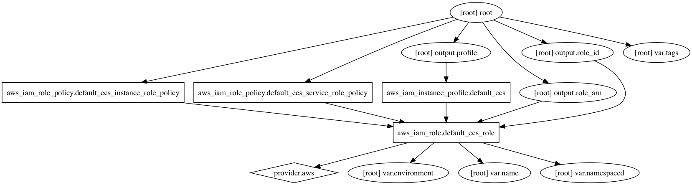

AWS IAM Role Terraform Module
=====================

Usage:
------

    module "iam_role" {
      source      = "../tf_iam_role"

      add variables
    }

## Inputs

| Name | Description | Default | Required |
|------|-------------|:-----:|:-----:|
| environment | Environment (ex: dev, qa, stage, prod) | - | yes |
| name | Name | - | yes |
| namespaced | Namespace all resources (prefixed with the environment)? | `true` | no |
| tags | A map of tags to add to all resources | `<map>` | no |

## Outputs

| Name | Description |
|------|-------------|
| profile |  |
| role_arn |  |
| role_id |  |

### Resource Graph

